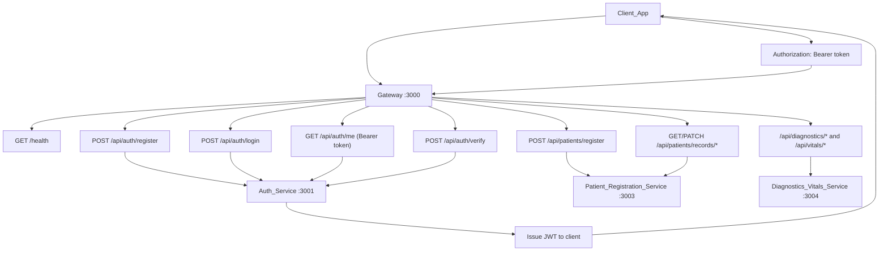

# Healthcare Management System

Healthcare Management System with microservice architecture: API Gateway, Auth Service, Patient Registration Service, and Diagnostics & Vitals Service.

## Project Structure

```
├── src/
│   └── gateway.js          # API Gateway (proxies auth/patient/diagnostics routes)
├── services/
│   └── auth-service/       # Auth microservice
│       ├── src/
│       │   ├── config/
│       │   ├── middleware/
│       │   ├── models/
│       │   ├── routes/
│       │   ├── services/
│       │   ├── utils/
│       │   └── server.js
│       ├── package.json
│       └── README.md
│   └── patient-registration-service/
│       ├── src/
│       │   ├── config/
│       │   ├── middleware/
│       │   ├── models/
│       │   └── server.js
│       └── package.json
└── shared/
```

## Auth Service Endpoints



| Method | URL | Description |
|--------|-----|-------------|
| POST | …/api/auth/register | Register, returns JWT |
| POST | …/api/auth/login | Login, returns JWT |
| GET | …/api/auth/me | Current user (Bearer token) |
| POST | …/api/auth/verify | Validate token |
| GET | …/health | Health check (gateway + backend status) |
| POST | …/api/patients/register | Register patient at service point (clerk role only) |
| GET | …/api/patients/records | Retrieve patient records (doctor, nurse, paramedic) |
| GET | …/api/patients/records/:id | Retrieve a single patient record (doctor, nurse, paramedic) |
| PATCH | …/api/patients/records/:id/visits | Append visit history with diseases/referral details (doctor, nurse, paramedic) |
| PATCH | …/api/patients/records/:id/prescriptions | Append prescription medicines (doctor write; doctor, nurse, paramedic read via records endpoints) |
| PATCH | …/api/patients/records/:id/nursing-notes | Append nursing chart details (nurse write; doctor, nurse, paramedic read via records endpoints) |

## Authentication Flow

1. **Register or login** via Auth: `POST …/api/auth/register` or `/login` (same origin when using gateway).
2. **Copy JWT** from response `data.token`.
3. **Call protected routes** with header: `Authorization: Bearer <token>`.
4. Backend services verify JWT using shared `JWT_SECRET` (no runtime call to Auth service for each request).
5. `POST …/api/patients/register` requires role `clerk` and accepts only:
   - Identity and basic details: `emiratesId`, `firstName`, `lastName`, `dateOfBirth`, `gender`, `phoneNumber`, `address`, `entryRoute`, `servicePoint`
   - Clinical intake notes: `knownDiseases` (string array), `complaints` (string array)
   - `entryRoute` is required and must be one of: `OPD`, `A&E`
6. `GET …/api/patients/records`, `GET …/api/patients/records/:id`, and `PATCH …/api/patients/records/:id/visits` require role `doctor`, `nurse`, or `paramedic`.
7. `PATCH …/api/patients/records/:id/prescriptions` requires role `doctor` and appends `{ medicines[], prescribedAt, notes? }`.
8. `PATCH …/api/patients/records/:id/nursing-notes` requires role `nurse` and appends `{ treatmentDetails, intakeOutput, recordedAt }`.
9. Prescriptions and nursing notes are append-only and returned as `prescriptions` and `nursingNotes` in patient record responses for doctor/nurse/paramedic.
10. Patient registrations are persisted by the patient registration service in the MongoDB `patients` collection (separate from auth `users`).
11. Duplicate prevention uses a SHA-256 hash of normalized `emiratesId`; only the hash is stored and it is unique per patient.
12. Patient `id` values are assigned sequentially by the patient registration service (`"1"`, `"2"`, `"3"`, ...).
13. Visit updates are append-only via `visitHistory` entries and preserve prior entries for auditability.

## Microservice Design Notes

- Gateway is only a routing edge and does not contain business logic.
- Auth service owns identity concerns (credentials, JWT issuing, token verification endpoint).
- Patient registration service owns `POST /api/patients/register` and all `/api/patients/records*` endpoints.
- Diagnostics & Vitals service owns `/api/diagnostics*` and `/api/vitals*` domain endpoints.

## Environment Variables

**Auth service** (`services/auth-service/.env`):
- `PORT` (default 3001)
- `MONGODB_URI`
- `JWT_SECRET` (must match auth-service)

**Gateway** (`.env`, optional):
- `GATEWAY_PORT` or `PORT` (default 3000)
- `AUTH_SERVICE_URL` (default http://localhost:3001)
- `PATIENT_REG_SERVICE_URL` (default http://localhost:3003)
- `DIAGNOSTICS_VITALS_SERVICE_URL` (default http://localhost:3004)

**Patient Registration Service** (`.env`):
- `PATIENT_REG_SERVICE_PORT` or `PORT` (default 3003)
- `MONGODB_URI` (MongoDB connection string for patient data)
- `JWT_SECRET` (must match auth-service)
- `PATIENT_ID_HASH_SALT` (optional salt for hashing `emiratesId`)
- `ALLOWED_ORIGINS`
