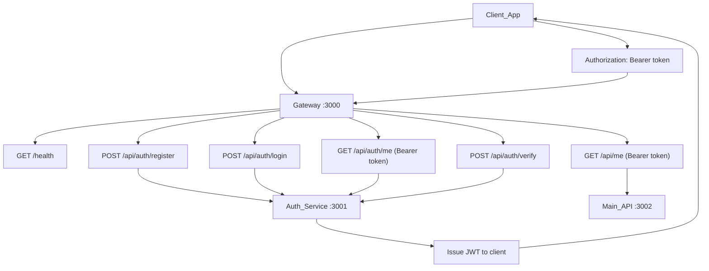

# Healthcare Management System

Healthcare Management System with microservice architecture: Auth service, business logic in main service, API gateway to loosely connect services

## Project Structure

```
├── src/                    # Main API + API Gateway
│   ├── gateway.js          # API Gateway (proxies /api/auth → auth, /api → main)
│   ├── middleware/
│   │   └── verifyToken.js  # JWT verification for protected routes
│   └── server.js           # Main API
├── services/
│   └── auth-service/       # Auth microservice
│       ├── src/
│       │   ├── config/
│       │   ├── middleware/
│       │   ├── models/
│       │   ├── routes/
│       │   ├── services/
│       │   ├── utils/
│       │   └── server.js
│       ├── package.json
│       └── README.md
├── docker-compose.yml      # Run all services
└── Dockerfile              # Main API
```

## Auth Service Endpoints



| Method | URL | Description |
|--------|-----|-------------|
| POST | …/api/auth/register | Register, returns JWT |
| POST | …/api/auth/login | Login, returns JWT |
| GET | …/api/auth/me | Current user (Bearer token) |
| POST | …/api/auth/verify | Validate token |
| GET | …/health | Health check (gateway: aggregated; main: single service) |
| GET | …/api/me | Validate token (Bearer) |
| POST | …/api/patients/register | Register patient at service point (clerk role only) |

## Authentication Flow

1. **Register or login** via Auth: `POST …/api/auth/register` or `/login` (same origin when using gateway).
2. **Copy JWT** from response `data.token`.
3. **Call protected routes** with header: `Authorization: Bearer <token>`.
4. Main API verifies JWT using shared `JWT_SECRET` (no call to Auth service).
5. `POST …/api/patients/register` requires role `clerk` and accepts only:
   - Basic details: `firstName`, `lastName`, `dateOfBirth`, `gender`, `phoneNumber`, `address`, `servicePoint`
   - Clinical intake notes: `knownDiseases` (string array), `complaints` (string array)

## Microservice Design Notes

- Gateway is only a routing edge and does not contain business logic.
- Auth service owns identity concerns (credentials, JWT issuing, token verification endpoint).
- Main API owns domain endpoints and validates JWT locally to avoid runtime coupling to auth-service availability.

## Environment Variables

**Auth service** (`services/auth-service/.env`):
- `PORT` (default 3001)
- `MONGODB_URI`
- `JWT_SECRET` (must match main API)

**Main API** (`.env`):
- `PORT` (default 3000 standalone; use 3002 when behind gateway)
- `JWT_SECRET` (must match auth-service)
- `ALLOWED_ORIGINS`

**Gateway** (`.env`, optional):
- `GATEWAY_PORT` or `PORT` (default 3000)
- `AUTH_SERVICE_URL` (default http://localhost:3001)
- `MAIN_SERVICE_URL` (default http://localhost:3002)
