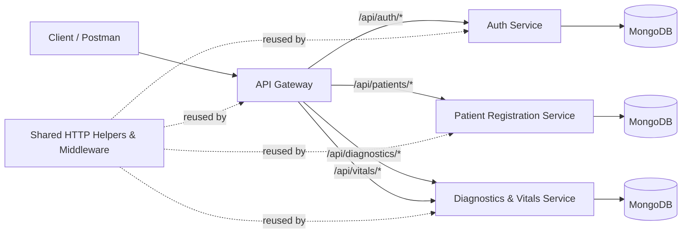

# Healthcare Management System

A backend healthcare platform built with a microservices architecture in Node.js. The system is organized around independent services behind a single API Gateway, with shared middleware/utilities and a Postman-based API test collection.

## Overview

The project focuses on core clinical workflow support, including:

- User authentication and token-based access control
- Patient registration and record management
- Diagnostics and vitals operations
- Service health monitoring through gateway and service-level endpoints

The architecture is modular so each domain can evolve independently while keeping a consistent API experience through the gateway.

## Architecture

Main components:

- API Gateway: request routing, edge middleware, and centralized entry point
- Auth Service: identity, login/registration, and token handling
- Patient Registration Service: patient profile and record operations
- Diagnostics & Vitals Service: diagnostics workflows and vitals capture/retrieval
- Shared Module: common middleware and response helpers reused across services



High-level structure:

```
Coursework/
├── src/                    # Gateway
├── services/               # Domain microservices
├── shared/                 # Shared middleware/helpers
├── postman/                # API collections and environment files
└── docs/                   # Architecture/security drafts and notes
```

## Getting Started

### Prerequisites

- Node.js (LTS recommended)
- npm
- MongoDB (local or hosted)

### Install dependencies

This repository uses npm workspaces for service packages. From the project root:

```bash
npm install
```

### Environment setup

1. Copy the example environment file and fill in your values:

```bash
cp .env.example .env
```

2. Configure at minimum:
   - service ports
   - MongoDB connection string
   - JWT secret
   - service URLs used by the gateway

### Run the project

Start all services in development mode:

```bash
npm run dev:all
```

## API and Testing

- API requests are routed through the gateway.
- Postman collections for integration testing are available in the `postman/` directory.
- Health check requests are included to validate service availability.

## Documentation

Additional design notes are available under `docs/`, including architecture and security write-ups.

## Notes

- This repository is intended for coursework/development usage.
- Keep secrets and environment-specific values in local `.env` files and avoid committing sensitive data.
