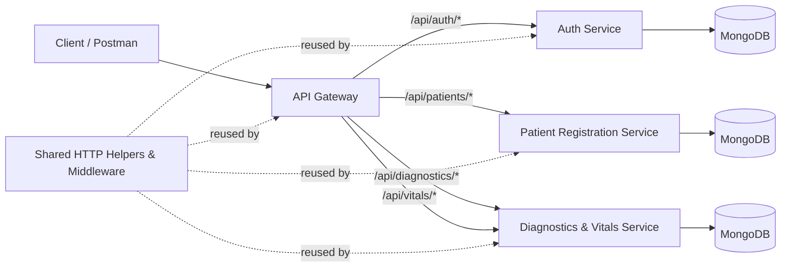

# Healthcare Management System

A backend healthcare platform built with a microservices architecture in Node.js. The system is organized around independent services behind a single API Gateway, with shared middleware/utilities and a Postman-based API test collection.

## Overview

The project focuses on core clinical workflow support, including:

- User authentication and token-based access control
- Patient registration and record management
- Diagnostics and vitals operations
- Service health monitoring through gateway and service-level endpoints

The architecture is modular so each domain can evolve independently while keeping a consistent API experience through the gateway.

## Architecture

Main components:

- API Gateway: request routing, edge middleware, and centralized entry point
- Auth Service: identity, login/registration, and token handling
- Patient Registration Service: patient profile and record operations
- Diagnostics & Vitals Service: diagnostics workflows and vitals capture/retrieval
- Shared Module: common middleware and response helpers reused across services


```mermaid
flowchart LR
   Client[Client / Postman] --> Gateway[API Gateway]

   Gateway -->|/api/auth/*| Auth[Auth Service]
   Gateway -->|/api/patients/*| Patient[Patient Registration Service]
   Gateway -->|/api/diagnostics/*| Diag[Diagnostics & Vitals Service]
   Gateway -->|/api/vitals/*| Diag

   Auth --> MongoAuth[(MongoDB)]
   Patient --> MongoPatient[(MongoDB)]
   Diag --> MongoDiag[(MongoDB)]

   Shared[Shared HTTP Helpers & Middleware] -. reused by .-> Gateway
   Shared -. reused by .-> Auth
   Shared -. reused by .-> Patient
   Shared -. reused by .-> Diag
```

## Repository Structure

```text
Coursework/
├── Dockerfile.gateway
├── ENV_SETUP.md
├── jenkinsfile
├── package.json
├── README.md
├── docs/
│   ├── architecture/
│   │   ├── api-flow.md
│   │   └── security-design.md
│   └── Drafts/
│       ├── architecture-overview.md
│       ├── justification.md
│       ├── mongodb-schema.md
│       ├── security.md
│       └── workflows.md
├── postman/
│   ├── collections/
│   │   └── Testing Coursework.postman_collection.json
│   ├── environments/
│   ├── globals/
│   │   └── workspace.postman_globals.json
│   └── specs/
├── services/
│   ├── auth-service/
│   │   ├── Dockerfile
│   │   ├── package.json
│   │   ├── README.md
│   │   └── src/
│   │       ├── server.js
│   │       ├── config/
│   │       │   ├── database.js
│   │       │   └── passport.js
│   │       ├── middleware/
│   │       │   ├── auth.js
│   │       │   └── validation.js
│   │       ├── models/
│   │       │   ├── DoctorSchedule.js
│   │       │   └── User.js
│   │       ├── routes/
│   │       │   ├── authRoutes.js
│   │       │   └── googleAuthRoutes.js
│   │       ├── services/
│   │       │   └── authService.js
│   │       └── utils/
│   │           └── jwt.js
│   ├── diagnostics-vitals-service/
│   │   ├── Dockerfile
│   │   ├── README.md
│   │   ├── server.js
│   │   ├── config/
│   │   │   └── database.js
│   │   ├── middleware/
│   │   │   ├── authorizeRole.js
│   │   │   └── verifyToken.js
│   │   ├── models/
│   │   │   ├── DiagnosticLogic.js
│   │   │   ├── DiagnosticSchema.js
│   │   │   └── VitalsSchema.js
│   │   └── services/
│   │       └── vitalsService.js
│   └── patient-registration-service/
│       ├── Dockerfile
│       ├── package.json
│       ├── README.md
│       └── src/
│           ├── server.js
│           ├── config/
│           │   └── database.js
│           ├── middleware/
│           │   ├── authorizeRole.js
│           │   └── verifyToken.js
│           └── models/
│               ├── Appointment.js
│               ├── audit.js
│               ├── Counter.js
│               ├── DoctorSchedule.js
│               └── Patient.js
├── shared/
│   └── http/
│       ├── cors.js
│       ├── handlers.js
│       └── responses.js
├── src/
│   ├── gateway.js
│   ├── config/
│   │   └── database.js
│   └── middleware/
│       ├── authorizeRole.js
│       └── verifyToken.js
└── secrets/
```

## Getting Started

### Prerequisites

- Node.js (LTS recommended)
- npm
- MongoDB (local or hosted)

### Install dependencies

This repository uses npm workspaces for service packages. From the project root:

```bash
npm install
```

### Environment setup

1. Copy the example environment file and fill in your values:

```bash
cp .env.example .env
```

2. Configure at minimum:
   - service ports
   - MongoDB connection string
   - JWT secret
   - service URLs used by the gateway

### Run the project

Start all services in development mode:

```bash
npm run dev:all
```

## API and Testing

- API requests are routed through the gateway.
- Postman collections for integration testing are available in the `postman/` directory.
- Health check requests are included to validate service availability.

## Jenkins Pipeline

Azure VM setup with Jenkins installed
<http://52.140.125.222:8080/>

### OWASP ZAP Stage

The Jenkins pipeline includes an authenticated OWASP ZAP baseline scan against the gateway running on the Jenkins host (`http://localhost`).

Required Jenkins credential:

- **Type:** Username with password
- **ID:** `zap-auth-credentials`
- **Username:** Test account email for auth login
- **Password:** Matching account password

Behavior:

- Brings up full stack with Docker Compose on the Jenkins VM.
- Authenticates via `POST /api/auth/login` and injects `Authorization: Bearer <token>` into ZAP requests.
- Generates reports under `reports/zap/` and archives them as Jenkins artifacts.
- Fails the pipeline only when **High-risk** ZAP alerts are found.

## Documentation

Additional design notes are available under `docs/`, including architecture and security write-ups.

## Notes

- This repository is intended for coursework/development usage.
- Keep secrets and environment-specific values in local `.env` files and avoid committing sensitive data.
