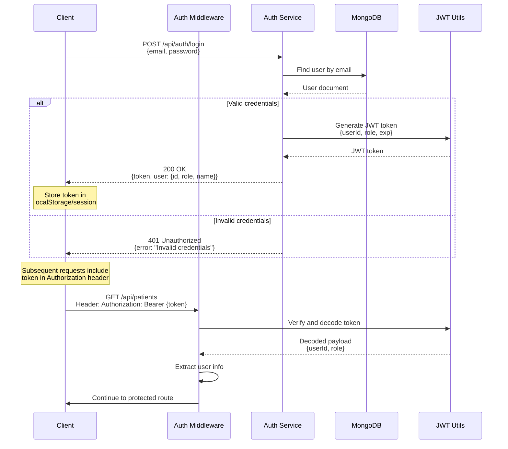
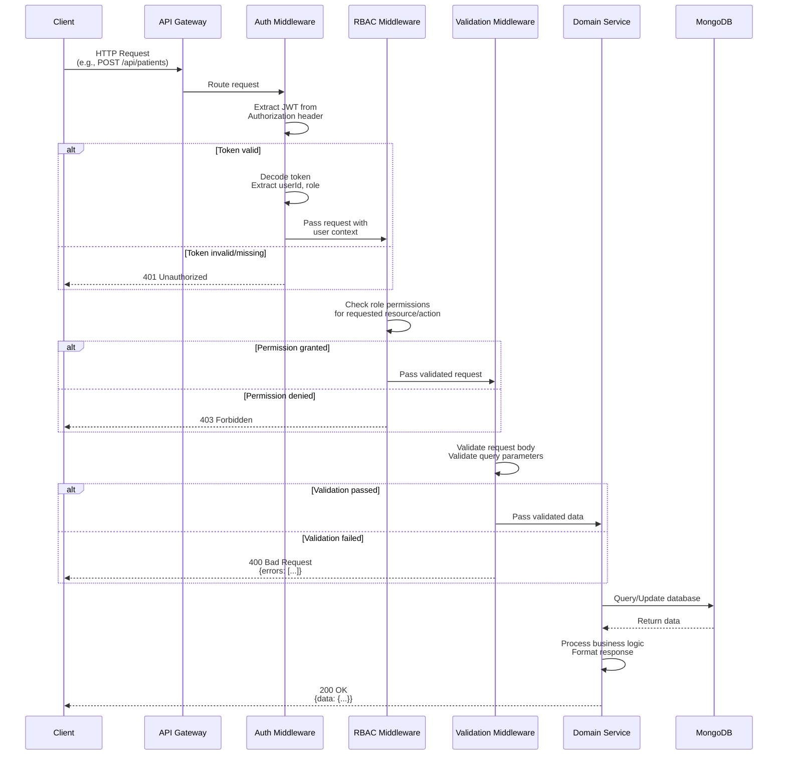
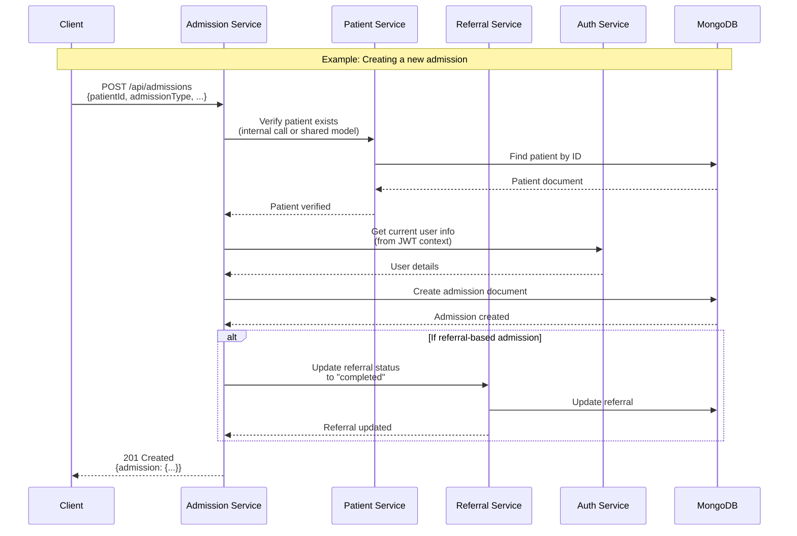

# API Architecture Diagrams - First Steps

## Authentication Flow
Will use JWT tokens



## Possible workflow for Protected Route Request Flow
Since we are dealing with patient records, this is confidential. We should consider a protected route request workflow for the same. Here's a possible workflow



## Service Interaction Flow
We'll be having a lot of services and they'll have to interact amongst each other. I've considered the mandatory Authentication, and the basic modules of Admission service, Patient service, Referral service. 



## Possible Endpoints
We'll add on to this as we go. Some things we need to discuss:  
 1) patient ids, appointment ids, staff ids
 2) how to query these together - basically database schema
 3) We need to employ all of CRUD

```
POST   /api/auth/register     - User registration
POST   /api/auth/login        - User login (returns JWT)
POST   /api/auth/refresh      - Refresh JWT token

GET    /api/patients          - List patients
POST   /api/patients          - Create new patient

GET    /api/admissions        - List admissions (with filters)
POST   /api/admissions        - Create new admission
GET    /api/admissions/active - Get all active admissions

GET    /api/referrals         - List referrals 
POST   /api/referrals         - Create new referral

GET    /api/appointments      - List appointments (with filters)
POST   /api/appointments      - Create new appointment

GET    /api/medical-records   - List medical records (with filters)
POST   /api/medical-records   - Create new medical record
```