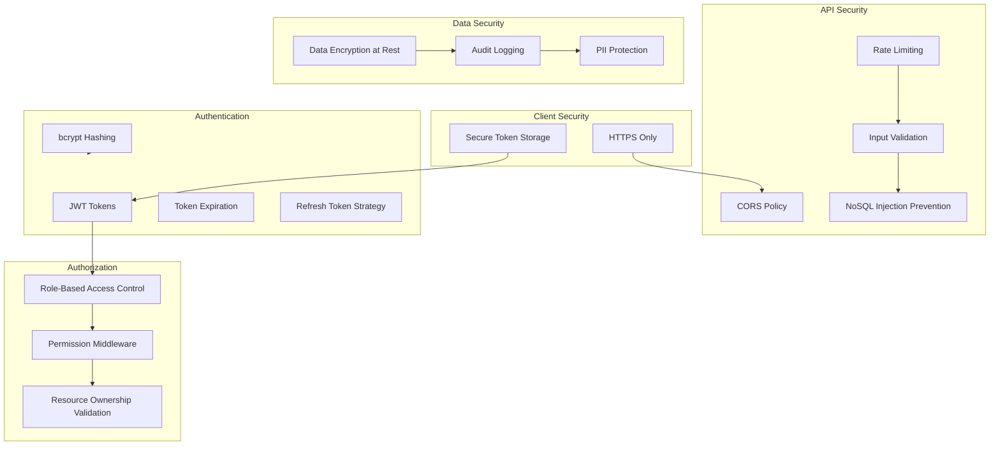

# Possible Authentication Architecture



## Authentication

### JWT Token Structure

JWT tokens consist of three parts: header, payload, and signature.

#### Token Payload
```json
{
  "userId": "507f1f77bcf86cd799439011",
  "email": "doctor@hospital.com",
  "role": "doctor",
  "department": "cardiology",
  "iat": 1642684800,
  "exp": 1642771200
}
```

**Token Fields:**
- `userId`: Unique user identifier
- `email`: User email (for identification)
- `role`: User role (clerk, doctor, nurse, paramedic)
- `department`: Optional department assignment
- `iat`: Issued at timestamp
- `exp`: Expiration timestamp (24 hours default)

#### Token Generation
```javascript
// Token generation process
const payload = {
  userId: user._id,
  email: user.email,
  role: user.role,
  department: user.department
};

const token = jwt.sign(payload, process.env.JWT_SECRET, {
  expiresIn: '24h',
  algorithm: 'HS256'
});
```

### Password Security

#### Password Hashing
- **Algorithm**: bcrypt
- **Salt Rounds**: 12 (recommended for production)
- **Storage**: Never store plaintext passwords (obvi :))

### Token Management
- **Client-side**: Store in httpOnly cookies (preferred) or localStorage
- **Server-side**: No token storage (stateless)
- **Token Revocation**: Implement blacklist for logged-out tokens (optional)

## Role-Based Access Control (RBAC)
Based on the doc, I see four primary roles: Clerk, Doctor, Nurse, Paramedic
Possible permissions each one can have (CRUD)

| Resource | Action | Clerk | Doctor | Nurse | Paramedic |
|----------|--------|-------|--------|-------|-----------|
| **Patients** | Create | ✓ | ✓ | ✓ | ✓ |
| | Read | ✓ | ✓ | ✓ | ✓ |
| | Update | ✓ | ✓ | ✓ | ✓ |
| | Delete | ✗ | ✗ | ✗ | ✗ |
| **Admissions** | Create | ✓ | ✓ | ✓ | ✓ |
| | Read | ✓ | ✓ | ✓ | ✓ |
| | Update | ✗ | ✓ | ✓ | ✗ |
| | Discharge | ✗ | ✓ | ✓ | ✗ |
| **Referrals** | Create | ✗ | ✓ | ✗ | ✗ |
| | Read | ✓ | ✓ | ✓ | ✗ |
| | Accept | ✗ | ✓ | ✗ | ✗ |
| | Complete | ✗ | ✓ | ✗ | ✗ |
| **Medical Records** | Create | ✗ | ✓ | ✓ | ✓ |
| | Read | ✓ | ✓ | ✓ | ✓ |
| | Update | ✗ | ✓ | ✓ | ✗ |
| | Delete | ✗ | ✗ | ✗ | ✗ |
| **Appointments** | Create | ✓ | ✓ | ✓ | ✗ |
| | Read | ✓ | ✓ | ✓ | ✓ |
| | Update | ✓ | ✓ | ✓ | ✗ |
| | Cancel | ✓ | ✓ | ✓ | ✗ |

## TODO [SCRUM-27]: API Endpoint Protection Strategy

## TODO [SCRUM-28]: Data Validation and Sanitization
